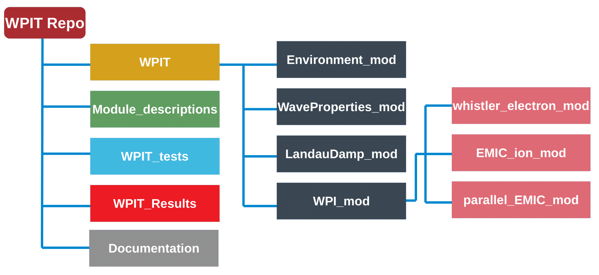

# WPIT
__________________________________________________________________________________________________________________________________________________________
The Wave-Particle Interactions Toolset is an open source, Python-based set of tools for modelling the interactions between energetic charged particles and whistler-mode waves in the magnetosphere through test particle simulations. Whereas numerous modelling techniques are described in literature, there is a lack of a unified open-source toolset that incorporates the equations and parameterizations used by different wave-particle interaction models in a user-friendly environment. WPIT incorporates key routines related to wave-particle interactions in a Jupyter Notebook environment, enabling the traceability of all relevant equations in terms of their derivation and key assumptions, together with the programming environment and integrated graphics that enable users to conduct state-of-the-art wave-particle interaction simulations rapidly and efficiently. As starting point, WPIT includes the sets of parameters of simulations that have been used in literature, enabling the exact reproduction of past reported findings and allowing the user to expand upon state-of-the-art. Specific capabilities of WPIT include: (a) routines for the calculation of the whistler mode wave characteristics, such as the refractive index, wave amplitude and resonant frequency, based on the local environmental parameters, such as plasma densities and geomagnetic field, according to cold plasma theory; (b) models of the interaction of charged particles with whistler mode waves under both gyro-averaged and full Lorentz equations of motion; (c) a ray tracing module, which enables incorporating ray tracing results in the simulations for the investigation of interactions of particles with natural (e.g. chorus) whistler-mode waves or artificial (e.g., ground or spaceborne VLF transmitter) waves; (d) routines for the characterization of the degree of non-linearity of wave-particle interactions; and (e) routines for calculating the near- and far-field, reactance, impedance and sheath characteristics of electromagnetic waves of a space-born transmitter. WPIT can be used either as a stand-alone simulation tool or as a library of routines that the user can extract and incorporate into an independent simulation. 

________________________________________________________________________________________________________________________________________________________
### The WPIT Repository

The WPIT folder contains the source code builded in the form of modules and sub-modules. WPIT contains four modules, i.e. the *Environment_mod*, the *WaveProperties_mod*, the *LandauDamp_mod* and the *WPI_mod*, which includes three sub-modules, i.e. the *whistler_electron_mod*, the *EMIC_ion_mod* and the *parallel_EMIC_mod*. The *Module_descriptions* folder contains Jupyter notebooks with analytic theoretical description of the equations of each module along with example calls of each routine. The *WPI_tests* folder contains reproduction of results of the literature in Jupyter notebook formats, which act as a verification of the code and as tutorials of the use of WPIT. The *WPIT_Results* folder contains the Jupyter notebooks of the simulations presented in WPIT paper. Lastly, the *Documentation* folder includes the API documentation of the source code in .html format.

________________________________________________________________________________________________________________________________________________________

### Testing

The WPIT code has been tested in Ubuntu 18.04LST with Python 3.6.9. The version of the packages for testing are:

- matplotlib 3.6.9

- numpy 1.19.5

